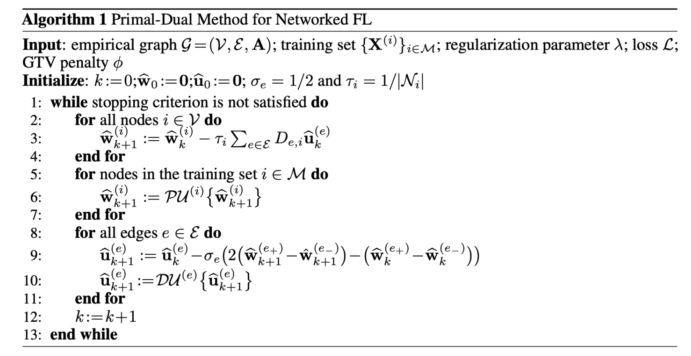

commit -m ''# Federated Multi-Task Learning from Big Data over Networks

This repository is the official implementation of [Federated Multi-Task Learning from Big Data over Networks](https://arxiv.org/abs/2030.12345) paper. 



The package related to the algorithm implementation is 
[algorithm](https://github.com/sahelyiyi/FederatedLearning/tree/master/algorithm)
 which has the following structure.

* [main.py](https://github.com/sahelyiyi/FederatedLearning/blob/master/algorithm/main.py)
    * the implementation of algorithm 1
* [optimizer.py](https://github.com/sahelyiyi/FederatedLearning/blob/master/algorithm/optimizer.py)
    * the primal optimizer for the loss functions, we have implemented 
    the squared error loss, and the logistic loss with `pytorch` 
    and also the straight forward primal optimizer in the 
    Networked Linear Regression section which is much faster than the `pytorch` one
* [penalty.py](https://github.com/sahelyiyi/FederatedLearning/blob/master/algorithm/penalty.py)
    * the different penalty functions for the dual optimizers explained in the paper, 
    `norm2`, `MOCHA`, and `norm1`
 
For running your own primal and dual optimizers you can inherit a class from `class Optimizer` 
and `class Penalty` respectively.

## Requirements

To install requirements:

```setup
pip install -r requirements.txt
```

>📋  For running the code you need to have python 3.7

## Experiments

In this repository we have multiple experiments

### Stochastic Block Model

* With Two Clusters: This SBM has two clusters |C<sub>1</sub>| =  |C<sub>2</sub>| = 100.
Two nodes within the same cluster are connected by an edge with probability `pin=0.5`, 
and two nodes from different clusters are connected by an edge with probability `pout=0.01`. 
Each node i &in; V represents a local dataset consisting of 
`m` feature vectors 
x<sup>(i,1)</sup>, ... , x<sup>(i,m)</sup> &in; R<sup>n</sup> . 
The feature vectors are i.i.d. realizations of a standard Gaussian random vector x ~ N(0,I).
The labels y<sup>i</sup><sub>1</sub>, ... , y<sup>i</sup><sub>m</sub> &in; R for each node i &in; V
are generated according to the linear model y<sup>i</sup><sub>r</sub> = (x<sup>(i, r)</sup>)<sup>T</sup>w&#772;<sup>(i)</sup> +  &epsilon; , 
with &epsilon; &in; N(0,&sigma;), weight vector w<sup>(i)</sup> = (2, 2)<sup>T</sup>
for i &in; C<sub>1</sub>, and w<sup>(i)</sup> = (-2, 2)<sup>T</sup> for i &in; C<sub>2</sub>. 
We assume that labels y<sup>(i)</sup> are available for 20% of the graph nodes.
as the result we compare the MSE of Algorithm 1 with plain linear regression 
and decision tree regression, please the [implementation](https://github.com/sahelyiyi/FederatedLearning/blob/master/SBM_experiment.ipynb).

```code
python main.py --name sbm_2
```

>📋  Describe how to train the models, with example commands on how to train the models in your paper, including the full training procedure and appropriate hyperparameters.


| Method name                    | Train MSE       | Tes MSE        |
| ------------------             |---------------- | -------------- |
| algorithm 1                    |    7.11e-06     |     9.18e-06   |
| plain linear regression        |    3.150        |     4.212      |
| decision tree regression       |    3.338        |     4.598      |


* With Five Clusters: The size of the clusters are {70, 10, 50, 100, 150} 
with random weight vectors ∈ R<sup>2</sup> selected uniformly from [0,1) . 
We run Algorithm 1 with a fixed pin = 0.5 and pout = 0.001, 
and a fixed number of 500 iterations. The tuning parameter &lambda; in algorithm1 
is manually chosen, guided by the resulting MSE, as &lambda; = 0.01 . 
We assume that labels y<sup>(i)</sup> are available for 20% of the graph nodes.
as the result we compare the MSE of Algorithm 1 with plain linear regression 
and decision tree regression, please see the [implementation](https://github.com/sahelyiyi/FederatedLearning/blob/master/SBM_experiment.ipynb).


| Method name                    | Train MSE       | Tes MSE        |
| ------------------             |---------------- | -------------- |
| algorithm 1                    |    6.22e-06     |     8.99e-06   |
| plain linear regression        |    0.1270       |     0.1344     |
| decision tree regression       |    0.3158       |     0.3075     |


### 3D Road Network Dataset

This dataset is constructed by adding elevation information to the [3D road 
network in North Jutland, Denmark](https://archive.ics.uci.edu/ml/datasets/3D+Road+Network+(North+Jutland,+Denmark)#) (covering a region of 185 × 135 km2), 
containing LATITUDE, LONGITUDE, and also ALTITUDE of regions. 
We consider a graph G represents this dataset, which its nodes 
are the regions of the dataset and are connected 
by edges to their nearby neighbours with the weights that are 
related to the distances between them. So the feature vector 
X<sup>(i)</sup> ∈ R<sup>1*2</sup> of node i ∈ V contains 
the latitude and longitude of its corresponding region, and the 
label y<sup>(i)</sup> ∈ R is its altitudes.

We use Algorithm 1 to learn the weight vectors w<sup>(i)</sup>
for a localized linear model. We assume that labels y<sup>(i)</sup>
are available for 30% of the graph nodes, thus, for 70% of the nodes 
in G we do not know the labels y<sup>(i)</sup> but predict them with the 
weight vectors w&#770;<sup>(i)</sup> obtained from Algorithm 1 
(using a fixed number of 1000 iterations, and λ = 0.2).
We compare the MSE of our method with simple linear regression 
and decision tree regression. please see the [implementation](https://github.com/sahelyiyi/FederatedLearning/blob/master/3d_road_experiment.ipynb).

| Method name                    | Train MSE       | Tes MSE        |
| ------------------             |---------------- | -------------- |
| algorithm 1                    |    0.023        |     20.898     |
| plain linear regression        |    278.67       |     296.69     |
| decision tree regression       |    181.60       |     174.05     |


### Networked Federated Deep Learning

In this section, we tested our method with Tensorflow ”cats vs dogs” Classification Dataset.
For both datasets, each node of the empirical graph G stands for 
a deep neural network in which the base model is 
Xception (with 132 layers) and has trained on the ImageNet dataset, 
also the new model containes a Global Average Pooling 2D, a Dropout, 
and a Dense layer (with linear activation, Adam optimizer, 
and Binary Cross Entropy loss function) respectively. 
The difference between the nodes is their training datasets.
Suppose that the training dataset for the node i is 
img<sub>1</sub>, ..., img<sub>t</sub>, 
we consider the result of the base model for the rth train image (img<sub>r</sub>) 
as the feature vector (x<sup>(i, r)</sup>), 
and the result of the new model as its label (y<sup>i</sup><sub>r</sub>), 
and w<sup>i</sup> is the weight vector of its Dense layer and 
the aim of this experiment is to estimate the weight vectors, 
w<sup>i</sup> of all the nodes.

The total number of nodes is 100, each node is connected to its 
3 nearest neighbours, the ones with the highest weights. 
We select 20 random nodes as the samplingset for Algorithm 1 
(with λ = 0.001 and a fixed number of 1000 iterations). 
Our method has increased the overall accuracy of the nodes in a significant
shorter time, the needed time for training each model with 
three learning epochs is almost 20 minutes, so training 100 models 
lasts 2000 minutes, while the computation time for our algorithm 
itself is less than 2 minutes. by adding the time for training 
the sampling set, which is 20 nodes, the total time would be 402 minutes 
(402 << 2000).


Fig: The accuracy for each model obtained after 1000 number of iterations 
used in Algorithm 1 based on the squared error loss . 
In this figure, the blue line shows the accuracy of the models 
based on the weights estimated by our method and the orange line shows 
the accuracy of the models by training its weights by the deep neural 
network after three epochs.


For reproducing the image please run :

```code
python main.py --name deep_learning
```


## Contributing

>📋  Pick a licence and describe how to contribute to your code repository. 
